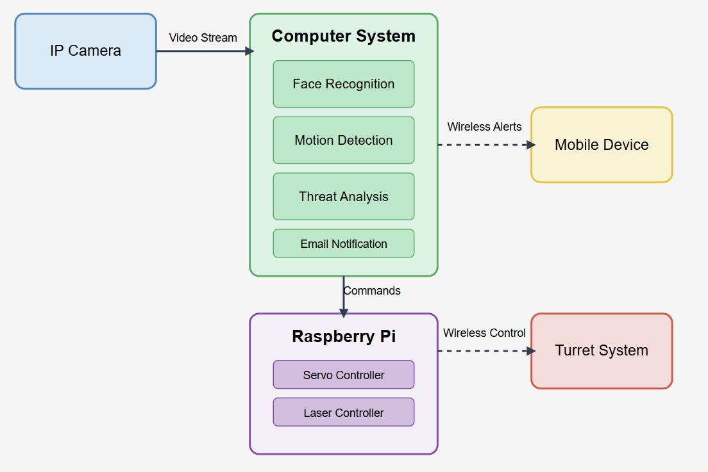

# ProactiveSense-Smart-Home-Intrusion-Detection-System
A smart home security system using Facial Recognition and IoT technologies to detect intrusions and engage with a tracking mechanism.

## Overview

This project implements a proactive home defense system that combines IoT technologies and machine learning to improve home security. The system consists of two primary components:

1. **Facial Recognition Surveillance**: Uses a camera to monitor entry points, recognizing authorized individuals and identifying unknown persons as potential threats.

2. **Proactive Defense**: When an unidentified individual is detected, the system activates a Raspberry Pi-controlled turret that tracks the person using a laser pointer while simultaneously sending alerts to the homeowner.

## Features

- Real-time face detection and recognition
- Authorized person database management
- Motion tracking with pan/tilt servo control
- Laser pointing for target tracking
- Email notifications with intruder images
- Web dashboard monitoring capability (in development)

## Hardware Requirements

- Raspberry Pi 3 Model B or newer
- Pi Camera or USB/IP Camera
- Pan and Tilt Servo motors (SG90 recommended)
- Laser diode module
- Servo HAT or GPIO connections for servo control
- Power supply for Raspberry Pi and servos

## Software Dependencies

- Python2.7.18+
- OpenCV
- face_recognition
- NumPy
- RPi.GPIO
- gpiozero
- Other Python libraries (see requirements.txt)

## Installation

1. Clone this repository:
```
git clone https://github.com/yourusername/ProactiveSense-Smart-Home-Intrusion-Detection-System.git
cd ProactiveSense-Smart-Home-Intrusion-Detection-System
```

2. Install required packages:
```
pip install -r requirements.txt
```

3. Setup hardware connections:
   - Connect pan servo to GPIO pin 12
   - Connect tilt servo to GPIO pin 13
   - Connect laser module to GPIO pin 25
   - Connect camera via USB or enable Pi Camera

4. Configure email settings in the script (for notifications)

## Usage

1. Run the main program:
```
ProactiveSense-Smart-Home-Intrusion-Detection-System.py
```

2. Add authorized faces by pressing 'a' when the program is running.

3. The system will automatically detect and track unknown faces, sending alerts when intruders are detected.

4. Press 'q' to quit the program.

## System Architecture



The system follows a modular design with the following components:

- **FaceRecognizer**: Handles face detection and recognition
- **TurretController**: Controls the physical pan/tilt servos and laser
- **NotificationSystem**: Sends alerts via email
- **HomeDefenseSystem**: Integrates all components and controls the main logic

## Safety Considerations

This project is intended for educational purposes only. The laser used is a low-power positioning laser that is safe for use. Never point lasers at people's eyes or use higher power lasers that could cause harm.

## Contributing

Contributions to improve the project are welcome. Please follow these steps:

1. Fork the repository
2. Create a feature branch (`git checkout -b feature/your-feature`)
3. Commit your changes (`git commit -am 'Add some feature'`)
4. Push to the branch (`git push origin feature/your-feature`)
5. Create a new Pull Request

## Future Enhancements

- Web interface for remote monitoring and control
- Integration with home automation systems
- Multiple camera support
- Improved face recognition accuracy
- Movement prediction for smoother tracking
- Mobile app notifications

## License

This project is licensed under the MIT License - see the LICENSE file for details.

## Acknowledgments

- This project was inspired by research in IoT security systems
- Thanks to the Raspberry Pi community for hardware guidance
- Based on the paper "Proactive Home Defence System Using IoT and Machine Learning" by Akin Babu Joseph, et al.
